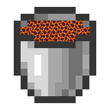

    
    <h2>Vine 1.20.6 (Beta)</h2>
      
    
    
    
    
      

**The September test is about to end and merge everything to the main line. **

**The main line is about to restore normal updates.**

[READ IN OUR PAGE!!!](https://docs.tranic.one/vine)

## Contact Us
Discord: https://discord.gg/dBbSbv2Vuz