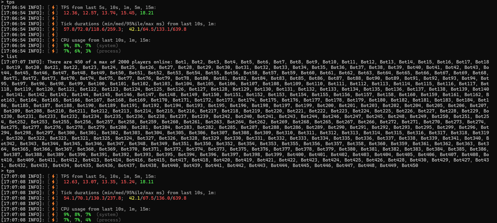

    
      
    
    
    
    
      

    <h2>Tranic Server</h2>
    
    &nbsp;&nbsp;&nbsp;&nbsp;&nbsp;&nbsp;
    
      

<h2 align=center>About them</h2>
Vine is a fork of <a href="https://github.com/MultiPaper/ShreddedPaper" target="_parent">ShreddedPaper</a>, redistributed under the <a href="https://github.com/LevelTranic/Vine?tab=GPL-3.0-1-ov-file#readme">GPL-3.0 license</a> . Supports multi-threading.

LevelBukkit is a fork of <a href="https://github.com/LuminolMC/Luminol" target="_parent">Luminol</a>/<a href="https://github.com/PaperMC/Folia" target="_parent">Folia</a>, republished under the <a href="https://github.com/LevelTranic/LevelBukkit?tab=MIT-1-ov-file"> MIT license</a>. Multi-threading is supported.

    <h2>Docs</h2>

- What is multithreading in Folia: [[1]](https://docs.papermc.io/folia/reference/overview)&nbsp;&nbsp;[[2]](https://docs.papermc.io/folia/reference/region-logic)
- What is multithreading in ShreddedPaper: [[1]](https://github.com/MultiPaper/ShreddedPaper/blob/main/HOW_IT_WORKS.md)&nbsp;&nbsp;[[2]](https://github.com/MultiPaper/ShreddedPaper/blob/main/DEVELOPING_A_MULTITHREAD_PLUGIN.md)

  

    <h2>Benchmark</h2>

The tests here are very simple.

<b>Use</b>

> Bot: [stress-test](https://github.com/PureGero/minecraft-stress-test)
> 
> Server: ShreddedPaper

<b>Config</b>
> Bot: Speed 0.6, Radius 1000000, Count 450
> 
> Server: Default

> Jvm: java --add-opens java.base/java.nio=ALL-UNNAMED --add-modules=jdk.incubator.vector --add-opens java.base/sun.nio.ch=ALL-UNNAMED -Xms9000M -Xmx9000M -Dfile.encoding=UTF-8 -XX:+UnlockExperimentalVMOptions -XX:+UnlockDiagnosticVMOptions -XX:+UseFMA -XX:+UseVectorCmov -XX:+UseNewLongLShift -XX:+UseFastStosb -XX:+SegmentedCodeCache -XX:+OptimizeStringConcat -XX:+DoEscapeAnalysis -XX:+OmitStackTraceInFastThrow -XX:+AlwaysActAsServerClassMachine -XX:+DisableExplicitGC -XX:AllocatePrefetchStyle=3 -XX:NmethodSweepActivity=1 -XX:ReservedCodeCacheSize=400M -XX:NonNMethodCodeHeapSize=12M -XX:+UseXmmI2F -XX:ProfiledCodeHeapSize=194M -XX:NonProfiledCodeHeapSize=194M -XX:-DontCompileHugeMethods -XX:+PerfDisableSharedMem -XX:UseAVX=2 -XX:+UseFastUnorderedTimeStamps -XX:+UseCriticalJavaThreadPriority -XX:+EagerJVMCI -Dgraal.TuneInlinerExploration=1 -Dgraal.BaseTargetSpending=160 -Dgraal.OptWriteMotion=true -Dgraal.WriteableCodeCache=true -XX:+UseZGC -XX:AllocatePrefetchStyle=1 -XX:+ZGenerational -server -jar shreddedpaper-paperclip-1.20.6-R0.1-SNAPSHOT-mojmap.jar nogui

> Java: openjdk 21.0.1 2023-10-17
> 
> OpenJDK Runtime Environment GraalVM CE 21.0.1+12.1 (build 21.0.1+12-jvmci-23.1-b19)
> 
> OpenJDK 64-Bit Server VM GraalVM CE 21.0.1+12.1 (build 21.0.1+12-jvmci-23.1-b19, mixed mode, sharing)

> Platform:
> Windows 11. i7-12700H, close all unnecessary processes

> This CPU is already close to full load, the server uses up all the performance, 
> and when I further increase the number of robots to 600, the tps dropped to 4-7 and thread errors started to occur.
> 
> On CPUs with more cores, such as AMD Threadripper, 
> there may be a better experience, I personally think so.

  

------

> Not finished yet, don't use